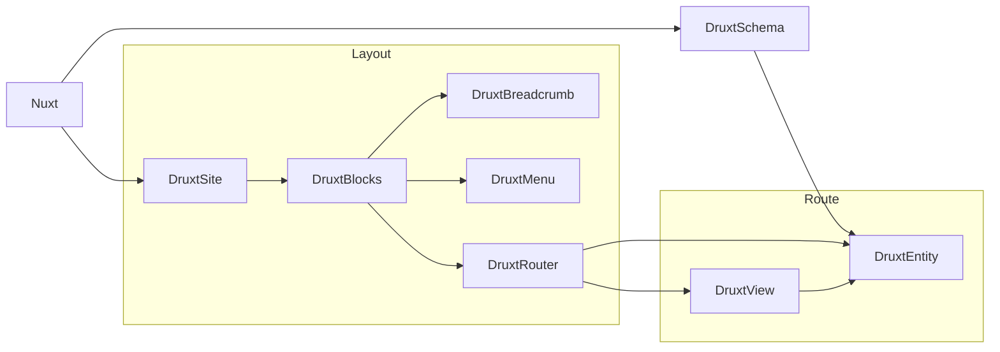

# Druxt 101

Fully Decoupled Drupal  
with JSON:API and Nuxt.js

[druxt-101.slides.realityloop.com](https://druxt-101.slides.realityloop.com)

<div class="pt-12">
  <span @click="$slidev.nav.next" class="px-2 p-1 rounded cursor-pointer" hover="bg-white bg-opacity-10">
    Press Space for next page <carbon:arrow-right class="inline"/>
  </span>
</div>

---
layout: image-right
image: https://s.gravatar.com/avatar/499831a65f45885a7e1b70ea47c06a58?s=800
---


# Stuart Clark

<div class="my-10 grid grid-cols-[40px,1fr] w-min gap-y-4">
  <mdi-briefcase class="opacity-50" />
  <div><a href="https://www.realityloop.com" target="_blank">Realityloop.com</a></div>
  <mdi-drupal class="opacity-50" />
  <div><a href="https://www.drupal.org/u/Deciphered" target="_blank">Deciphered</a></div>
  <mdi-github class="opacity-50" />
  <div><a href="https://github.com/decipher" target="_blank">Decipher</a></div>
  <mdi-earth class="opacity-50"/>
  <div>Australia</div>
</div>

<!--
Hello

I'm Stuart Clark:
* Senior Decoupled Developer @ Realityloop in Australia
* Drupal developer of 15 years
* Vue developer for 3/4 years
* Project lead of Druxt

Which is what I'm here to talk about today...
-->

---
layout: module
---

<div class="grid grid-cols-[2fr,2fr] gap-4">
  <div class="text-center pb-4">
    
    <div class="mb-2 text-sm">
      <h1>Druxt</h1>
      <a href="https://druxtjs.org" target="_blank">druxtjs.org</a><br />
      <a href="https://www.youtube.com/channel/UC3rybROe6cP9Uly_qQEW-4w" class="no-underline" target="_blank">
        <mdi-youtube class="inline-block no-underline opacity-50" />
      </a>
      <a href="https://twitter.com/druxtjs" class="no-underline" target="_blank">
        <mdi-twitter class="inline-block no-underline opacity-50" />
      </a>
    </div>
    <div class="opacity-50 mb-2 text-sm">
      An open source framework for building<br />
      Fully Decoupled Drupal integrations with Nuxt.js.
    </div>
    <div class="text-center">
      <a class="!border-none" href="https://www.npmjs.com/package/druxt" target="__blank"></a>
    </div>
  </div>
  <div class="!all:leading-12 !all:list-none my-auto">

  - **Content and configuration** in the backend
  - **Routing and rendering** in the frontend
  - **Entities**, **Fields**, **Forms** and **Display modes**
  - **Views** pages and blocks
  - **Blocks**, **Regions**, **Menus** & more
  - Auto filtering **JSON:API** client w/**Vuex caching**
  - **Server side** and **Client side** rendering
  - **Static site generation**

  </div>
</div>

<!--
What is Druxt?

Druxt is a full decoupled framework for Frontend developers to build modern user experiences for Drupal using Nuxt.js.

Unlike regular Drupal Decoupling, Druxt consumes both Content and Configuration, allowing for Entities and Forms with Fields and Display modes, Views, Blocks, Regions and more.

This gives you the ability to both "Do it the Drupal way" and "Do it the 'JS' way", or somewhere in between: "Do it your way".

Druxt exists to provide a better and easier Frontend Experience, because Drupal doesn't do a good enough job on its own.
-->

---
layout: section
---

## Backend / L*MP

<div class="grid grid-cols-[2fr,2fr] gap-4">
  <div class="text-center pb-4">
    
    <div class="mb-2 text-sm">
      <h2>Drupal 8</h2>
      <a href="https://drupal.org/8" target="_blank">drupal.org/8</a>
    </div>
    <div class="opacity-50 mb-2 text-xl">
      Build something amazing
    </div>
    <div class="text-center">
    </div>
  </div>

  <div class="my-auto text-center pb-4 pl-8">
    
    <div class="mb-2 text-sm">
      <h2>Drupal 9</h2>
      <a href="https://drupal.org/9" target="_blank">drupal.org/9</a>
    </div>
    <div class="opacity-50 mb-2 text-xl">
      Build the best of the web
    </div>
    <div class="text-center">
    </div>
  </div>
</div>

## Frontend / Jamstack

<div class="grid grid-cols-[2fr,2fr] gap-4">
  <div class="text-center pb-4">
    
    <div class="mb-2 text-sm">
      <h2>Vue.js</h2>
      <a href="https://vuejs.org" target="_blank">vuejs.org</a>
    </div>
    <div class="opacity-50 mb-2 text-xl">
      The Progressive JavaScript Framework
    </div>
  </div>

  <div class="my-auto text-center pb-4 pl-8">
    
    <div class="mb-2 text-sm">
      <h2>Nuxt.js</h2>
      <a href="https://nuxtjs.org" target="_blank">nuxtjs.org</a>
    </div>
    <div class="opacity-50 mb-2 text-xl">
      The Intuitive Vue Framework
    </div>
  </div>
</div>

<!--
Druxt is Fully decoupled, which means it requires two codebases: Drupal for the Backend and Nuxt.js for the Frontend.

Both Drupal 8 and 9 are supported, and Druxt can be used installed on existing sites or distributions, such as ContentaCMS.

If you're not familiar with Nuxt, it's a modular Vue.js framework, much like Drupal is a modular PHP framework.

It does all the hard things you don't want to have to do when decoupling or working with javascript:
- Builds and chunks your javascript bundle
- Provides extensible page based routing
- Supports Server Side and Client side rendering as well as Static Site Generation

Nuxt 2 uses Vue 2, but Nuxt 3 is due for a public beta soon which will add support for Vue 3.

Find out more a nuxtjs.org
-->

---
class: text-center
layout: fact
---

# TL;DR

## Druxt = DRUpal + nUXT

<!--
To put it simply, Druxt is Drupal plus Nuxt.
-->

---
layout: section
---

# Table of Contents

0. Introduction
1. Getting started using DruxtSite
2. Theming with Wrappers and Slots
3. Single Page Applications with Druxt components
4. Entity forms and reactivity
5. Static Site Generation
6. #GetInvolved
7. Q & A

[druxt-101.slides.realityloop.com](https://druxt-101.slides.realityloop.com)

<!--
Druxt is a big project, and there is a lot to talk about.

45 minutes isn't enough time to cover everything here in the detail it deserves. The slides are available for your perusal, which contain links and examples for many of the things I'll be discussing.

I'm also happy to make myself available to anyone who wants to learn more about Druxt, you can find me on the Drupal Slack #druxt channel, the Druxt discord and Twitter.

Let's get started.
-->

---
background: https://source.unsplash.com/collection/94734566/1920x1080
class: text-center
layout: cover
---

# Getting Started

## using DruxtSite

<!--
DruxtSite is the quickest way to get started if you are looking to build a decoupled Site.

It's nearly zero-config and sets up all the required frontend modules for a semi-traditional Drupal site with a Vue.js based theming system.
-->

---
layout: youtube-left
id: PQcTyIpdHsk
---


# Getting Started

## Drupal

1. Download Drupal
```sh
composer create-project -s dev \
drupal/recommended-project [DESTINATION]
```

2. Download Druxt module
```sh
composer require drupal/druxt
```

3. Quickstart
```sh
php ./web/core/scripts/drupal quick-start
```

4. Install Druxt module: [/admin/modules](http://127.0.0.1:8888/admin/modules#edit-modules-other)

5. Configure permissions: [/admin/people/permissions](http://127.0.0.1:8888/admin/people/permissions#module-druxt)

<!--
Setting up your Druxt backend is relatively straight forward:
- Download Drupal
- Download the Druxt module
- Enable the Druxt module
- Add the Druxt permission to a user Role

## Timing

- 0:35 - Drupal downloaded
- 0:47 - Druxt module downloaded
- 1:07 - Drupal installed
- 1:37 - Druxt Setup
-->

---
layout: youtube-right
id: aWoQRb4F3FY
---


# Getting Started

## Nuxt

1. Download Nuxt
```sh
npx create-nuxt-app [DESTINATION]
```

2. Download DruxtSite module
```sh
npm i druxt-site
```

3. Configure `nuxt.config.js`
```js
modules: ['druxt-site'],
druxt: {
  baseUrl: 'https://example.com',
  site: { theme: 'bartik' },
}
```

4. `npm run dev`

<!--
To setup your frontend you need to:
- Download Nuxt
- Download the Druxt modules you wish to use
- Edit the `nuxt.config.js` file

## Timing

- 1:00 - Nuxt downloaded
- 1:19 - DruxtSite downloaded
- 1:51 - Setup
-->

---
class: text-center
layout: cover
---

# Live demo
## Getting Started with DruxtSite

<div class="mb-10" />

https://gitpod.io#github.com/druxt/quickstart-druxt-site

<!--
In this demo I'm using the DruxtSite quickstart repository.

I'll be running it locally, but you can follow along using the gitpod link, which I'll drop into the chat now:

The repository is setup with:
- Drupal pre-installed and configured using DDev.
- Nuxt pre-installed and setup with the DruxtSite module.

Let's take a look:

You can see straight away that there's a lot going on, but codewise the frontend only consists of a small amount of configuration.

So, what's going on?

A default Layout is injected into Nuxt to render the DruxtSite component, which renders all the available Block regions for the specified theme. This can be customised and overridden as needed.

The blocks order and visibility are determined by the Drupal backend, although the order of the Block regions isn't, as Drupal doesn't provide that information out of the box: [Show backend]

The current page is rendered via the Drupal "Main page content" block using the DruxtRouter and the Drupal Decoupled Router module.

Out of the box, using the standard Drupal installation profile, this renders the frontpage view, which you can see here.

Let's go make some content so we can see this better: [make content]

The layout and settings of the Entity fields are determined by the Display mode, but can be fully overridden in the frontend using DruxtWrapper components.
-->

---
layout: section
---

# How the Druxt does it work?



<!--
That was a lot of stuff, so let's recap:

- During build:
  - Nuxt generates DruxtSchema files
- During render:
  - Nuxt renders the DruxtSite
  - DruxtSite renders all available Block regions for the configured theme
  - The Block regions render the visible Blocks for the current route, including, but not limited to the Breadcrumb, Menu and Content blocks.
  - The Content block renders the page for the Nuxt route, or the wildcard DruxtRouter page.
  - The DruxtRouter page renders a DruxtView or DruxtEntity based on the resolved Decoupled Route.
  - DruxtViews render DruxtEntities
  - DruxtEntities use the generated schemas to render the appropriate fields for the chosen Display mode.
-->

---
background: /images/umami-storybook.png
class: text-center
layout: cover
---

# Theming

## with Wrappers and Slots

<!--
Druxt components use a DruxtWrapper component theming system, which uses Props and Slots to allow you to take full control, or use the sane defaults based on the Drupal configuration.

It's a hybrid of Drupal's own theming system, but using Vue single file components instead of Twig, Javascript and CSS files.

And everything is components by design.
-->

---
layout: section
---

# Vue crash course

### Warning: Information overload

<!--
Given that this is a DrupalCon, I'll assume that not everyone is familiar with Vue.js.

I'll do my best to explain how it all works, but there are far better resources and teachers out there than me.

You can find more about Vue at VueJS.org
-->

---
layout: full
---

## Vue single file component

```vue {all|1-7|9-18|20-24}
<template>
  <article>
    <h2>{{ entity.attributes.title }}</h2>
    <slot name="body" />
    <AppButton :to="link" @click="onClick">Click me</AppButton>
  </article>
</template>

<script>
export default {
  computed: {
    link: ({ entity }) => entity.attributes.path.alias || `/node/${entity.attributes.drupal_internal__nid}`,
  },
  methods: {
    onClick() { ... }
  }
}
</script>

<style scoped>
h2 {
  color: #007bff;
}
</style>
```

<!--
This is an example of a Vue file, it is a single file that contains everything needed for this component; Markup, Javascript and CSS.

This alone, in my opinion, is one of the biggest benefits of decoupling, having everything encapsulated in a single place.

If you've ever spent time digging through Drupal JS behaviours, or heavily nested CSS files, it's worth taking a closer look at Vue.
-->

---
image: /images/devtools-attrs-props-slots.png
layout: image-right
---

## $attrs, mixins, props & slots

```vue
<template>
  <article v-bind="$attrs">
    <h2>{{ entity.attributes.title }}</h2>
    <slot name="field_image" />
    <slot name="field_tags" />
    <slot name="body" />
  </article>
</template>

<script>
import { DruxtEntityMixin } from 'druxt-entity'
export default {
  mixins: [DruxtEntityMixin],
}
</script>
```

<div class="mb-5" />

- **$attrs**: attributes / unregistered properties
- **mixins**: vue presets
- **props**: properties
- **slots**: template regions / data

<!--
Vue components have access to $attrs and props, or attributes and properties, as well as mixins and slots, among other things.

In the case of this DruxtEntity Wrapper component, your $attrs and props are the data that the component has retrieved from Drupal via the JSON:API.

Mixins are just helpers to setup your component, and in the case of most Druxt components, they simply register your props.

Slots are template regions that are injected into the component. Druxt components use slots to provide sane defaults; a DruxtEntity wrapper has a slot for each Field, which will render a DruxtField component so you don't need to do it yourself.

The screenshots on the right are from the Vue developer tools, it will show you everything you have access to, and is an invaluable tool.
-->

---
layout: image-right
image: /images/components.png
position: left
---

# @nuxt/components

##### nuxt.config.js
```js
export default {
  components: true
}
```

<div class="mb-10" />

## DruxtWrapper

- Components provide `component.options`
- First available used

Example:

```jsx
<DruxtEntity type="node--article">
```

- DruxtEntityNodeArticleDefault.vue
- druxt/entity/node/article/Default.vue

<!--
Nuxt 2.13 added the Components module, which automatically scans the `components/` directory and registers your components, so you don't have to.

Subdirectories are used to generate prefixed, which allows for logical grouping of your components; druxt / entity / node / article / teaser becomes DruxtEntityNodeArticleTeaser

Druxt components provide multiple options for the Wrapper component, much like Drupals own Template Suggestions.

This allows for a Wrapper per Entity Display mode, or View Display, etc.

You can see the available options by using the Vue developer tools, they are shown on the Druxt component under `data.component.options`
-->

---
layout: image-right
image: /images/umami-storybook.png
position: top left
---


# @nuxtjs/storybook

[storybook.nuxtjs.org](https://storybook.nuxtjs.org/)

<div class="mb-8" />

### + Druxt =

Zero-config, auto-generated Storybook integration with Druxt modules.

<div class="mb-16" />

## Getting started

<div class="mb-4" />

1. Download @nuxtjs/storybook module
```sh
npm i -D @nuxtjs/storybook postcss@latest
```

2. `npx nuxt storybook`

<!--
The @nuxtjs/storybook module allows for Nuxt modules to provide integration with Storybook.

This allows for Druxt modules to provide auto-generated stories that use live data from your Drupal backend, allowing you to theme your components using real content.

Enough talk, let's do some live theming.
-->

---
class: text-center
layout: cover
---

# Live demo
## Theming with Storybook

<div class="mb-10" />

https://gitpod.io#github.com/druxt/quickstart-druxt-site

<!--
Storybook is installed and ready to go in the Quickstart repository, you just need to run `npx nuxt storybook` and give it a few seconds to things up and running.
-->

---
background: https://source.unsplash.com/collection/94734566/1920x1080
class: text-center
layout: cover
---

# Single Page Applications

## with Druxt Components

<!--
While DruxtSite gives you an out of the box site experience, it's still mostly based around "Doing it the Drupal way".

But the benefits of Decoupling is being able to do it your own way.

One of the biggest client needs I've seen unfulfilled by Drupal is the ability to make "Campaign pages", or "Single Page Applications", that use their Drupal content and branding, but isn't locked into the Drupalisms. There's always something that should be easy, but just can't be done in Drupal.
-->

---
layout: full
---

# Druxt components

```vue
<template>
  <div>

    <DruxtBlock id="umami_branding" />

    <DruxtBreadcrumb />

    <DruxtMenu name="main" />

    <DruxtEntity type="node--article" :uuid="uuid" mode="teaser" />

    <DruxtView display-id="block_1" view-id="promoted_items" />

  </div>
</template>
```

<div class="mb-5" />

* See https://druxtjs.org/api/components

<!--
The components that DruxtSite uses can be used on their own, in Nuxt pages, custom components, or even in the DruxtWrapper components.

Different Druxt modules provide different components, and can be installed without DruxtSite. You can find more details at Druxtjs.org

Storybook is the best way to get started when building your page, as it allows you to look through the available components and provides you with the required markup.
-->

---
layout: full
---

# Template injection

```vue
<template>
  <DruxtEntity
    mode="default"
    type="node--article"
    uuid="b5cb94eb-9d14-4cea-9c3b-433ac5ebfead"
  >
    <template #default="article">
      <h1 class="text-3xl">{{ article.entity.attributes.title }}</h1>

      <DruxtEntity
        type="file--file"
        :uuid="article.entity.relationships.field_image.data.id"
      >
        <template #default="file">
          
        </template>
      </DruxtEntity>

      {{ article.entity.attributes.body.summary }}
    </template>
  </DruxtEntity>
</template>
```

<!--
When using a Druxt component directly, while the DruxtWrapper components will still be respected, you are also able to take full control of the default Slot contents using Template injection.

Think of the Druxt component as a client module; it takes the provided props and returns the resulting data to the default template, where you can use it to define the output.

This example is loading an entity and passing it's props to an `article` object, which is rendering out the markup as required, as well as rendering a nested DruxtEntity for the related Image field entity.
-->

---
class: text-center
layout: cover
---

# Live demo
## Building pages

<div class="mb-10" />

https://gitpod.io#github.com/druxt/quickstart-druxt-site

---
background: https://source.unsplash.com/collection/94734566/1920x1080
class: text-center
layout: cover
---

# Entity forms

## and reactivity

---
image: /images/druxt-entity-form.png
layout: image-right
---

# DruxtEntityForm

```jsx
<DruxtEntityForm
  type="contact_message--feedback_form"
/>
```

<div class="mb-10" />

## v-model

```vue
<template>
  <div>
    <DruxtEntity v-bind="props" v-model="model">
    <DruxtEntityForm v-bind="props" v-model="model">
  </div>
</template>

<script>
export default {
  data: () => ({
    model: null,
    props: { type: 'node--article', uuid: '...' }
  }),
}
</script>
```

<!--
The DruxtEntityForm component is just an extension of the DruxtEntity component. It uses the same Field system, but using configuration from Form Displays.

It also has basic support for POST and PATCH requests, to send data to your Drupal backend.

The `v-model` directive allows for data binding on Vue components. It's reactive, meaning that changes are instantaneously synchronised between components.

This example demonstrates a simple pattern to connect a DruxtEntity and DruxtEntityForm together, allowing for live editing. 
-->

---
class: text-sm
id: OL_bRANN6oA
layout: youtube-right
---

# EditBar experiment

<div class="my-10 grid grid-cols-[40px,260px] w-min gap-y-4">
  <ri-cloud-line class="opacity-50"/>
  <div><a href="https://nginx.feature-239-editbar.demo-druxtjs-org.au2.amazee.io/en/recipes/vegan-chocolate-and-nut-brownies" target="_blank">nginx.feature-239-editbar.demo-druxtjs-org.au2.amazee.io</a></div>
  <mdi-github class="opacity-50" />
  <div><a href="https://github.com/druxt/demo.druxtjs.org/pull/261" target="_blank">druxt/demo.druxtjs.org/pull/261</a></div>
</div>


<!--
The EditBar is a User Experience experiment to demonstrate one of the many ways to bring editing to the frontend in a Fully Decoupled Drupal site.

Let's take a look at the demo.

The source code is all available on github, so be sure to check it out.
-->

---
class: text-center
layout: cover
---

# Live demo
## Nearly headless blog

<div class="mb-10" />

https://gitpod.io/#github.com/Decipher/example-druxt-blog

---
id: SoWU5PfE7SI
layout: youtube-right
---

# Static Site Generation

1. Configure `nuxt.config.js`
```js
target: 'static',
ssr: true,

// optional.
generate: {
  routes: ['/', '/en', '/es'],
}
```

2. `npm run generate`

3. (optional) `npm start`

<!--
Static Site generation works out of the box, as long as you have `target: 'static'` set.

Nuxt will crawl all accessible links and generate HTML pages for Drupals content.

If
-->

---
background: https://source.unsplash.com/collection/94734566/1920x1080
class: text-center
layout: cover
---

# \#GetInvolved

## discord.druxtjs.org / #druxt @ Drupal Slack

---
layout: two-cols
---

# Druxt

<div />

Docs:
- [druxtjs.org](https://druxtjs.org)
- [druxtjs.org/guide](https://druxtjs.org/guide)
- [druxtjs.org/guide/CONTRIBUTING](https://druxtjs.org/guide/CONTRIBUTING)
- [druxtjs.org/modules](https://druxtjs.org/modules)

Mono-repo:
- [github.com/druxt/druxt.js](https://github.com/druxt/druxt.js)
- [github.com/druxt/druxt.js/issues](https://github.com/druxt/druxt.js/issues)

Support:
- [discord.druxtjs.org](https://discord.druxtjs.org)
- [drupal.org/slack](https://drupal.org/slack) #druxt

<div class="mb-10" />

::right::
# Drupal

<div />

Projects:
- [drupal.org/project/decoupled_router](https://drupal.org/project/decoupled_router)
- [drupal.org/project/decoupled_menus_initiative](https://www.drupal.org/project/decoupled_menus_initiative)
- [drupal.org/project/druxt](https://drupal.org/project/druxt)
- [drupal.org/project/jsonapi_hypermedia](https://drupal.org/project/jsonapi_hypermedia)
- [drupal.org/project/jsonapi_menu_items](https://drupal.org/project/jsonapi_menu_items)
- [drupal.org/project/jsonapi_resources](https://drupal.org/project/jsonapi_resources)
- [drupal.org/project/jsonapi_views](https://drupal.org/project/jsonapi_views)

Slack:
- #contenta
- #decoupled
- #decoupled-menu-initiative

<!--
Both Druxt and general decoupling
-->

---
class: text-sm
id: R6eM3JQ_pv8
layout: youtube-right
---


# Umami Parity project

<div class="mb-10" />

<div class="my-10 grid grid-cols-[40px,260px] w-min gap-y-4">
  <ri-cloud-line class="opacity-50"/>
  <div><a href="https://demo.druxtjs.org" target="_blank">demo.druxtjs.org</a></div>
  <ri-cloud-line class="opacity-50"/>
  <div><a href="https://druxt-umami.netlify.app" target="_blank">druxt-umami.netlify.app</a></div>
  <ri-artboard-line class="opacity-50"/>
  <div><a href="http://umami-storybook.druxtjs.org" target="_blank">umami-storybook.druxtjs.org</a></div>
  <ri-github-line class="opacity-50"/>
  <div><a href="https://github.com/druxt/demo.druxtjs.org" target="_blank">github.com/druxt/demo.druxtjs.org</a></div>
  <ri-github-line class="opacity-50"/>
  <div><a href="https://github.com/druxt/demo-api.druxtjs.org" target="_blank">github.com/druxt/demo-api.druxtjs.org</a></div>
</div>

<!--
The Umami installation profiles provides a great example of what Drupal can give you out of the box.

As such, it's the obvious choise to demonstrate what the DruxtSite can give you out of the box.

Let's take a quick look:
[Demo]

Features:
- Search layout component
- Drupal driven entities / contact form
- Frontend editing
- Storybook integration
-->

---
class: text-center
layout: cover
---

# Sponsors

<div class="grid grid-cols-[2fr,2fr] gap-4">
  <div class="text-center pb-4 mt-8">
    <a href="https://www.realityloop.com" target="_blank"></a>
    <div class="mb-2 text-sm mt-14">
      <h2>Development</h2>
    </div>
  </div>

  <div class="my-auto text-center pb-4 pl-8">
    <a href="https://amazee.io" target="_blank"></a>
    <div class="mb-2 text-sm">
      <h2>Hosting</h2>
    </div>
  </div>
</div>

<!--
A big thanks to Realityloop for sponsored development on the project.

And to lagoon for providing community hosting for the website.
-->

---
background: https://source.unsplash.com/collection/94734566/1920x1080
class: text-center
layout: cover
---

# Questions

## and answers

---
class: text-center
layout: cover
---

# Find out more

<div class="grid grid-cols-[2fr,2fr] gap-4 !all:border-0 mt-5 !all:mb-5">
  <a href="https://druxtjs.org">druxtjs.org</a>
  <a href="https://github.org/druxt">github.org/druxt</a>
  <a href="https://discord.druxtjs.org">discord.druxtjs.org</a>
  <a href="https://druxt-101.slides.realityloop.com">druxt-101.slides.realityloop.com</a>
</div>
