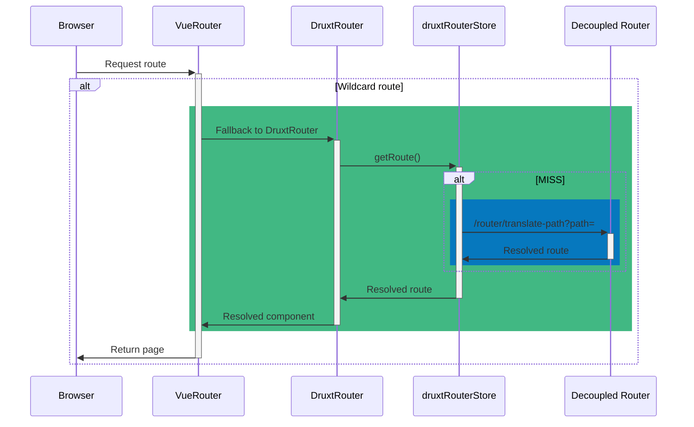

# Druxt 101

Fully Decoupled Drupal  
with JSON:API and Nuxt.js

<div class="pt-12">
  <span @click="$slidev.nav.next" class="px-2 p-1 rounded cursor-pointer" hover="bg-white bg-opacity-10">
    Press Space for next page <carbon:arrow-right class="inline"/>
  </span>
</div>

<!--
@todo Background image / video
-->

---
layout: image-right
image: https://s.gravatar.com/avatar/499831a65f45885a7e1b70ea47c06a58?s=800
---

# Stuart Clark

<div class="my-10 grid grid-cols-[40px,1fr] w-min gap-y-4">
  <mdi-briefcase class="opacity-50" />
  <div><a href="https://realityloop" target="_blank">Realityloop.com</a></div>
  <mdi-drupal class="opacity-50" />
  <div><a href="https://www.drupal.org/u/Deciphered" target="_blank">Deciphered</a></div>
  <mdi-github class="opacity-50" />
  <div><a href="https://github.com/decipher" target="_blank">Decipher</a></div>
  <mdi-nuxt class="opacity-50" />
  <div><a href="https://druxtjs.org" target="_blank">DruxtJS.org</a></div>
  <mdi-earth class="opacity-50"/>
  <div>Australia</div>
</div>

<!--
@todo Add Realityloop logo

* Senior Decoupled Developer @ Realityloop in Australia
* Deciphered @ Drupal.org (~15years)
* Project lead @ DruxtJS

With me today is ...

@todo Put Brian and me on half/quater slide?
-->

---
layout: center
---

<div class="grid grid-cols-[2fr,2fr] gap-4">
  <div class="text-center pb-4">
    
    <div class="mb-2 text-sm">
      <h1>Druxt</h1>
      <a href="https://druxtjs.org" target="_blank">druxtjs.org</a>
    </div>
    <div class="opacity-50 mb-2 text-sm">
      An open source framework for building<br />
      Fully Decoupled Drupal integrations with Nuxt.js.
    </div>
    <div class="text-center">
      <a class="!border-none" href="https://www.npmjs.com/package/druxt" target="__blank"></a>
    </div>
  </div>
  <div class="!all:leading-12 !all:list-none my-auto">

  - Drupal and Node module(s)
  - Drupal JSON:API client
  - Modular Vue.js component library
  - Vuex resource and collection cache
  - SPA / SSG / SSR
  - Fully Decoupled first

  </div>
</div>

<!--
# Druxt

What is Druxt?

An open source framework for building Fully Decoupled Drupal integrations with Nuxt

- It is Drupal and Node Modules.
- it's aDrupal JSON:API Client
- a Modular Vue component library system with a Vuex store based caching system
  - Partial resources
  - Dehydration of both collection and included resources
- It can be used for Single Page Applications, Static Site Generation, Server Side Rendering and a combination of the lot.
- Fully decoupled first, possibly progressively too.
-->

---
layout: center
---

<div class="grid grid-cols-[2fr,2fr] gap-4">
  <div class="text-center pb-4">
    
    <div class="mb-2 text-sm">
      <h1>Drupal 8</h1>
      <a href="https://drupal.org/8" target="_blank">drupal.org/8</a>
    </div>
    <div class="opacity-50 mb-2 text-xl">
      Build something amazing
    </div>
    <div class="text-center">
    </div>
  </div>

  <div class="my-auto text-center pb-4 pl-8">
    
    <div class="mb-2 text-sm">
      <h1>Drupal 9</h1>
      <a href="https://drupal.org/9" target="_blank">drupal.org/9</a>
    </div>
    <div class="opacity-50 mb-2 text-xl">
      Build the best of the web
    </div>
    <div class="text-center">
    </div>
  </div>
</div>

<!--
Druxt works with both Drupal 8 and 9, and can work on existing sites and distributions, including but not limited to ContentaCMS and Tide.
-->

---
layout: center
---

<div class="grid grid-cols-[2fr,2fr] gap-4">
  <div class="text-center pb-4">
    
    <div class="mb-2 text-sm">
      <h1>Druxt<small class="text-sm text-gray-400">.module</small></h1>
      <a href="https://drupal.org/project/druxt" target="_blank">drupal.org/project/druxt</a>
    </div>
  </div>
  <div class="pl-8 my-auto">

  ### Requires:

  <div class="text-sm py-4 !all:leading-6 !all:list-none">

  - Decoupled Router
  - JSON:API Menu Items
  - JSON:API Views

  </div>

  ### Provides:

  <div class="text-sm py-4 !all:leading-6 !all:list-none">

  - Read-only permission for required resources
  - Block condition plugin bypass
  - Enables Cross-Origin Resource Sharing (CORS)

  </div>
  </div>
</div>

<!--
The Druxt module is ideally a temporary measure, and all things it does could be handled by Drupal core in the future.

- Enables required modules:
  - Decoupled router
  - JSON:API Menu Items at the moment, however it will also support the Drupal Decoupled Menu Initiative solution in the future.
  - JSON:API Views (beta release).
- Adds a Read-only permission for required resources
- Adds bypass for block condition plugin system to allow for decoupled blocks
- Enables CORS
-->

---
layout: center
---

<div class="grid grid-cols-[2fr,2fr] gap-4">
  <div class="text-center pb-4">
    
    <div class="mb-2 text-sm">
      <h1>Vue.js</h1>
      <a href="https://vuejs.org" target="_blank">vuejs.org</a>
    </div>
    <div class="opacity-50 mb-2 text-xl">
      The Progressive JavaScript Framework
    </div>
    <div class="text-center">
      <a class="!border-none" href="https://www.npmjs.com/package/vue" target="__blank"></a>
    </div>
  </div>

  <div class="my-auto text-center pb-4 pl-8">
    
    <div class="mb-2 text-sm">
      <h1>Nuxt.js</h1>
      <a href="https://nuxtjs.org" target="_blank">nuxtjs.org</a>
    </div>
    <div class="opacity-50 mb-2 text-xl">
      The Intuitive Vue Framework
    </div>
    <div class="text-center">
      <a class="!border-none" href="https://www.npmjs.com/package/nuxt" target="__blank"></a>
    </div>
  </div>
</div>

<!--
Druxt is Vue.js 2 and Nuxt.js 2, and support will be added for Vue 3 and Nuxt 3 in the future.
-->

---
layout: center
---

<div class="grid grid-cols-[2fr,2fr] gap-4">
  <div>
    <h2>DruxtBlocks</h2>
    <div class="pb-2 text-sm">Blocks and regions</div>
    <a class="!border-none" href="https://www.npmjs.com/package/druxt-blocks" target="__blank"></a>
  </div>

  <div>
    <h2>DruxtBreadcrumb</h2>
    <div class="pb-2 text-sm">Route based breadcrumbs</div>
    <a class="!border-none" href="https://www.npmjs.com/package/druxt-breadcrumb" target="__blank"></a>
  </div>

  <div>
    <h2>DruxtEntity</h2>
    <div class="pb-2 text-sm">Entities, forms and fields</div>
    <a class="!border-none" href="https://www.npmjs.com/package/druxt-entity" target="__blank"></a>
  </div>

  <div>
    <h2>DruxtMenu</h2>
    <div class="pb-2 text-sm">Menus and menu items</div>
    <a class="!border-none" href="https://www.npmjs.com/package/druxt-menu" target="__blank"></a>
  </div>

  <div>
    <h2>DruxtRouter</h2>
    <div class="pb-2 text-sm">Wildcard router</div>
    <a class="!border-none" href="https://www.npmjs.com/package/druxt-router" target="__blank"></a>
  </div>

  <div>
    <h2>DruxtSchema</h2>
    <div class="pb-2 text-sm">Entity display modes and field formatters</div>
    <a class="!border-none" href="https://www.npmjs.com/package/druxt-schema" target="__blank"></a>
  </div>

  <div>
    <h2>DruxtSite</h2>
    <div class="pb-2 text-sm">Out-of-the-box Decoupled Drupal</div>
    <a class="!border-none" href="https://www.npmjs.com/package/druxt-site" target="__blank"></a>
  </div>

  <div>
    <h2>DruxtViews</h2>
    <div class="pb-2 text-sm">Drupal Views pages and blocks</div>
    <a class="!border-none" href="https://www.npmjs.com/package/druxt-views" target="__blank"></a>
  </div>
</div>

<!--
And Druxt comprises of 8 notable core modules, with several in the pipeline, including DruxtAuth.

You can also create your own custom modules by extending the DruxtModule component.
-->

---
layout: cover
class: text-center
---

# TL;DR

## Druxt = DRUpal + nUXT

<!--
TL;DR, Druxt is Drupal plus Nuxt, it's as simple as that.
-->

---
layout: center
---

# Table of Contents

1. DruxtSite - Umami Parity project
2. Getting started with DruxtSite
3. Themeing (DruxtWrapper)
4. Blocks & Regions
5. Storybook
6. Single Page Applications
7. Static Site Generation

<!--
Druxt is a big project, and there is a lot to talk about.

In case we are unable to cover everything today, checkout the slides in your own time.

Any topics you wish to prioritise, please let Brian know in the chat or via the poll.
-->

---
background: https://source.unsplash.com/collection/94734566/1920x1080
class: text-center
layout: cover
---

# DruxtSite

## Umami Parity project

<!--
Let's get started with DruxtSite and the Umami Parity project.
-->

---
layout: center
---

<div class="grid grid-cols-[2fr,2fr] gap-4">
  <div class="text-center pb-4">
    
    <div class="mb-2 text-sm">
      <h1>DruxtSite</h1>
      <a href="https://site.druxtjs.org" target="_blank">site.druxtjs.org</a>
    </div>
    <div class="opacity-50 mb-2 text-sm">
      Out of the box, Decoupled Drupal site experience.
    </div>
    <div class="text-center">
      <a class="!border-none" href="https://www.npmjs.com/package/druxt-site" target="__blank"></a>
    </div>
  </div>
  <div class="!all:leading-12 !all:list-none my-auto">

  - Decoupled router
  - Drupal powered Entity, Fields and Forms
  - Blocks and Regions
  - ~~Vuews~~ Views
  - Menus, Breadcrumbs, etc
  - Reactive content editing

  </div>
</div>

<!--
Druxt is not necessarily for out of the box Drupal sites but the DruxtSite module is.

It provides:
- a Decoupled router
- Drupal powered Entity, Fields and Forms
- Blocks and Regions
- Views, Menus, Breadcrumbs, and more

And as Druxt is Reactive by default, it supports inline content editing via the `v-model` directive.
-->

---
layout: youtube-right
id: R6eM3JQ_pv8
class: text-sm
---

# Umami Parity project

<div class="mb-10" />

<div class="my-10 grid grid-cols-[40px,260px] w-min gap-y-4">
  <ri-cloud-line class="opacity-50"/>
  <div><a href="https://demo.druxtjs.org" target="_blank">demo.druxtjs.org</a></div>
  <ri-cloud-line class="opacity-50"/>
  <div><a href="https://druxt-umami.netlify.app" target="_blank">druxt-umami.netlify.app</a></div>
  <ri-artboard-line class="opacity-50"/>
  <div><a href="http://umami-storybook.druxtjs.org" target="_blank">umami-storybook.druxtjs.org</a></div>
  <ri-github-line class="opacity-50"/>
  <div><a href="https://github.com/druxt/demo.druxtjs.org" target="_blank">github.com/druxt/demo.druxtjs.org</a></div>
  <ri-github-line class="opacity-50"/>
  <div><a href="https://github.com/druxt/demo-api.druxtjs.org" target="_blank">github.com/druxt/demo-api.druxtjs.org</a></div>
</div>

<!--
@todo Add Umami logo on slide and improve layout / style

[Click play]

This is the Umami Parity project, it's my testing ground and goal posts for the Druxt 1.0 release.

The Backend is a standard Drupal Umami profile install, with the Druxt module and some minor customisations.

The Frontend is an instance of the DruxtSite module using the BootstrapVue UI framework and custom DruxtWrapper theme components.

Let's take a quick walk through of the site __ BRIAN:
(BRIAN TO SHARE)
- It's serving Full Statically generated HTML, which Nuxt hydrates to provide client-side navigation.
- This also allows for Layout components, which provide modern User experience.
- The Frontend is hosted on Amazee's Lagoon, however, being Full static allows it to run on services like Netlify and Vercel.

The source code is all available on github, so be sure to check it out.
-->

---
background: https://source.unsplash.com/collection/94734566/1920x1080
class: text-center
layout: cover
---

# Getting Started

## with DruxtSite

<!--
Now, let's talk about how to get started using DruxtSite yourself.

Being Fully decoupled, Druxt requires both a Drupal and a Nuxt codebase.
-->

---
layout: youtube-left
id: PQcTyIpdHsk
---


# Getting Started

## Drupal

1. Download Drupal
```sh
composer create-project -s dev drupal/recommended-project [DESTINATION]
```

2. Download Druxt module
```sh
composer require drupal/druxt
```

3. Quickstart
```sh
php ./web/core/scripts/drupal quick-start
```

4. Install Druxt module: [/admin/modules](http://127.0.0.1:8888/admin/modules#edit-modules-other)

5. Configure permissions: [/admin/people/permissions](http://127.0.0.1:8888/admin/people/permissions#module-druxt)

<!--
Druxt/Decoupled Drupal needs a Drupal backend.

Drupal 8 and 9 are both supported, and the Druxt module should work with existing sites or distributions, like Contenta.

A permission is provided for READ ONLY access to JSON:API endpoints required by the Druxt fontend modules.

## Timing

- 0:35 - Drupal downloaded
- 0:47 - Druxt module downloaded
- 1:07 - Drupal installed
- 1:37 - Druxt Setup
-->

---
layout: youtube-right
id: aWoQRb4F3FY
---


# Getting Started

## Nuxt

1. Download Nuxt
```sh
npx create-nuxt-app [DESTINATION]
```

2. Download DruxtSite module
```sh
npm i druxt-site
```

3. Configure `nuxt.config.js`
```js
modules: [
  ...
  'druxt-site',
],

druxt: {
  baseUrl: 'https://example.com',
}
```

4. `npm run dev`

<!--
@TODO - Druxt is a Functional Framework, not a Design library.

## Timing

- 1:00 - Nuxt downloaded
- 1:19 - DruxtSite downloaded
- 1:51 - Setup
-->

---
background: /images/nuxt-welcome.png
class: text-center
layout: cover
---

# Welcome to ~~Nuxt~~ Druxt

## (Round 1)

<div class="my-10 grid grid-cols-[30px,100px] w-min gap-y-4 mx-auto">
  <ri-home-line class="opacity-50"/>
  <div><a href="http://localhost:3000" target="_blank">localhost:3000</a></div>
</div>

<!--
Druxt extends Nuxt, and in the case of the DruxtSite module we can see that by the presence of the DruxtRouter wildcard route.

Nuxt has a Page based routing system, which allows frontend driven campaign pages and single page apps, among other things, but in our case we want Drupal to serve the homepage, so I'll go ahead and delete this page.

1. Show Page
2. Open VueDevTools > Routes
3. Delete `pages/index.vue`
4. Reveal no content.
5. Walkthrough components
6. Recap
-->

---
layout: image-right-position
position: top left
image: /images/druxt-welcome.png
---

<div class="pb-4 text-center">
  
  <div class="mb-2 text-sm">
    <h1>DruxtRouter</h1>
    <a href="https://router.druxtjs.org" target="_blank">router.druxtjs.org</a>
  </div>
  <div class="opacity-50 mb-2 text-sm">
    Simple decoupled Drupal routing for Nuxt.
  </div>
  <div class="text-center">
    <a class="!border-none" href="https://www.npmjs.com/package/druxt-router" target="__blank"></a>
  </div>
</div>

<!--
Once we delete the default Nuxt page, we see the No Result text for the Frontpage View, as per a standard Drupal installation.
-->

---



<!--
This is provided via the DruxtRouter module, which uses Drupals Deocupled Router module to determine the JSON:API resource and Druxt component to render.

The route data is cached in the druxtRouter vuex store, reducing queries to the Drupal backend.
-->

---
layout: center
---

<div class="grid grid-cols-[2fr,2fr] gap-4">
  <div class="pb-4 text-center">
    
    <div class="mb-2 text-sm">
      <h1>DruxtViews</h1>
      <a href="https://views.druxtjs.org" target="_blank">views.druxtjs.org</a>
    </div>
    <div class="opacity-50 mb-2 text-sm">
      Drupal Views Vue.js components for Nuxt.js
    </div>
    <div class="text-center">
      <a class="!border-none" href="https://www.npmjs.com/package/druxt-views" target="__blank"></a>
    </div>
  </div>
  <div class="pb-4 pl-8">

```jsx
<DruxtView
  :display-id="displayId"
  :view-id="viewId"
/>
```


  </div>
</div>

<!--
In this case, the route is the Drupal Frontpage View, so the DruxtView module is used to render this route.

The DruxtView component can also be used in a standard Nuxt page or Vue component.

It requires a View ID or UUID, and an optional Display ID.
-->

---
background: /images/drupal-cms.png
class: text-center
layout: cover
---

# Content & Configuration

## (Round 2)

---
layout: center
---

<div class="grid grid-cols-[2fr,2fr] gap-4">
  <div class="pb-4 text-center">
    
    <div class="mb-2 text-sm">
      <h1>DruxtEntity</h1>
      <a href="https://entity.druxtjs.org" target="_blank">entity.druxtjs.org</a>
    </div>
    <div class="opacity-50 mb-2 text-sm">
      Drupal Display Mode powered Entity, Form and Field Vue.js component system.
    </div>
    <div class="text-center">
      <a class="!border-none" href="https://www.npmjs.com/package/druxt-entity" target="__blank"></a>
    </div>
  </div>
  <div class="pb-4 pl-8">

```jsx
<DruxtEntity
  :mode="displayMode"
  :type="resourceType"
  :uuid="uuid"
/>
```


  </div>
</div>

---
image: /images/components.png
layout: image-right-position
position: left
---

<div class="pb-4 text-center">
  
  <div class="mb-2 text-sm">
    <h1>DruxtSchema</h1>
    <a href="https://schema.druxtjs.org" target="_blank">schema.druxtjs.org</a>
  </div>
  <div class="opacity-50 mb-2 text-sm">
    Entity Form and View mode schemas for Drupal driven frontends.
  </div>
  <div class="text-center">
    <a class="!border-none" href="https://www.npmjs.com/package/druxt-schema" target="__blank"></a>
  </div>
</div>

<!--
Builds all schema files during Nuxt build step.

Currently requires restart to regeneate schemas :(
-->

---
background: /images/components.png
class: text-center
layout: cover
---

# Theming

## DruxtWrapper

---

# Theming

### Slots & Wrappers

```vue {all|1-7|9-15|17-21}
<template>
  <BCard>
    <h2>{{ entity.attributes.title }}</h2>
    <slot name="body" />
    <BButton :to="link" variant="success">Read more</BButton>
  </BCard>
</template>

<script>
export default {
  computed: {
    link: ({ entity }) => entity.attributes.path.alias || `/node/${entity.attributes.drupal_internal__nid}`,
  },
}
</script>

<style scoped>
h2 {
  color: #007bff;
}
</style>
```

<!--
Druxt provides Wrapper components for theming the modules.

A wrapper is just a Vue component:
- Template: `.tpl.php/.twig` HTML + Components, Slots and Mustache templates.
- Script: `.js` Vue & Nuxt data, props, methods, etc
- Style: `.css` Multi-lingual, scope, PostCSS processing

Each module provides slots and $attrs as well as a mixin to register props.

Example: `druxt/entity/node/article/teaser.vue`
-->

---

# Theming

### $attrs, props & mixins

<div class="grid grid-cols-[2fr,2fr] gap-4 mt-4 text-sm">
  <div>

```jsx
<template>
  <div>{{ $attrs.entity.attributes.title }}</div>
</template>
```

All unregistered props data is provided as `$attrs`.

It is recommended to register your `props`, or use the `mixin` provided by the module.

  </div>
  <div>

```jsx
<template>
  <div>{{ entity.attributes.title }}</div>
</template>

<script>
import { DruxtEntityMixin } from 'druxt-entity'

export default {
  mixins: [DruxtEntityMixin],
}
</script>
```

  </div>
</div>

---
image: /images/components.png
layout: image-right-position
position: left
---

# Theming

### Wrapper component options + discovery


<!--
- Druxt modules provide options for the Wrapper component.  
- Nuxt (>= v2.13) auto imports components.  
- First available option is used.  
- Most modules provide a default if no Wrapper component found.  
-->

---
background: https://source.unsplash.com/collection/94734566/1920x1080
class: text-center
layout: cover
---

# Prettification

## (Round 3)

<!--
1. Inspect DruxtEntity with VueDevTools
2. Show data > component > options.
3. Create `druxt/entity/node/article/Teaser.vue`
4. Navigate to node
5. ...storybook
-->

---
background: https://source.unsplash.com/collection/94734566/1920x1080
class: text-center
layout: cover
---

# Blocks & Regions

---
layout: center
---

<div class="grid grid-cols-[2fr,2fr] gap-4">
  <div class="pb-4 text-center">
    
    <div class="mb-2 text-sm">
      <h1>DruxtBlocks</h1>
      <a href="https://blocks.druxtjs.org" target="_blank">blocks.druxtjs.org</a>
    </div>
    <div class="opacity-50 mb-2 text-sm">
      Provides Drupal blocks and region components.
    </div>
    <div class="text-center">
      <a class="!border-none" href="https://www.npmjs.com/package/druxt-blocks" target="__blank"></a>
    </div>
  </div>
  <div class="pb-4 pl-8">

```jsx
<DruxtBlock :id="drupal_internal__id" />
```

```jsx
<DruxtBlockRegion 
  :name="name"
  :theme="theme"
/>
```


  </div>
</div>

---
background: /images/umami-storybook.png
class: text-center
layout: cover
---

# Storybook

---
layout: youtube-right
id: ek8BlCghwkE
---


# @nuxtjs/storybook

[storybook.nuxtjs.org](https://storybook.nuxtjs.org/)

<div class="mb-8" />

### + Druxt =

Zero-config, auto-generated Storybook integration with Druxt modules.

<div class="mb-16" />

## Getting started

<div class="mb-4" />

1. Download @nuxtjs/storybook module
```sh
npm i -D @nuxtjs/storybook
```

2. `npx nuxt storybook`

<!--
Druxt provides zero-config, auto-generated Storybook integration.

## Timing

- 0:31 - Installed
- 1:05 - Running

### Blocks

1. Bartik > Secondary Menu >> DruxtBlock (initial)
2. Docs tab
3. Expand "Content" region

### Entity

- 1:30

1. Node > Article > View displays > Default
2. Canvas tab
3. Mode > teaser
4. Change UUID (needs 2xArticles)

### Views

- 1:50

1. Frontpage > Master
2. Open in new tab
3. Vue developer tools
-->

---
background: /images/umami-storybook.png
class: text-center
layout: cover
---

# Story time

## (Round 4)

<!--
1. Open Storybook > Entity > Node > Article > View displays > Docs
2. Brief walkthrough
3. Open Default in new tab
4. Open Vue dev tools
5. Add template
    ```vue
    <template>
    </template>
    ```
-->
