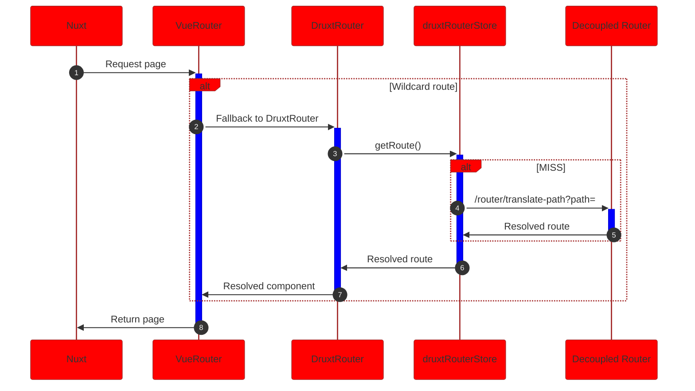
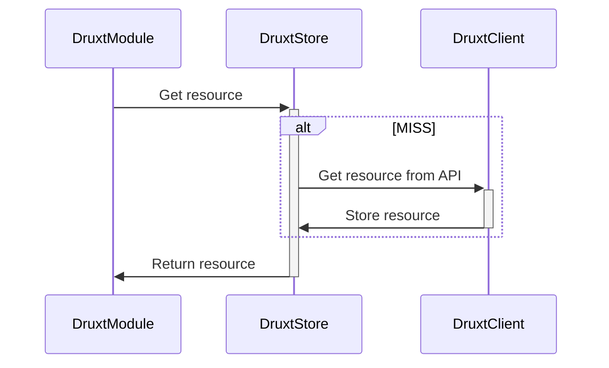

# Druxt 101

Fully Decoupled Drupal  
with JSON:API and Nuxt.js

<div class="pt-12">
  <span @click="$slidev.nav.next" class="px-2 p-1 rounded cursor-pointer" hover="bg-white bg-opacity-10">
    Press Space for next page <carbon:arrow-right class="inline"/>
  </span>
</div>

<!--
@todo Background image / video
-->

---
layout: image-right
image: https://s.gravatar.com/avatar/499831a65f45885a7e1b70ea47c06a58?s=800
---

# Stuart Clark

<div class="my-10 grid grid-cols-[40px,1fr] w-min gap-y-4">
  <mdi-briefcase class="opacity-50" />
  <div><a href="https://realityloop" target="_blank">Realityloop.com</a></div>
  <mdi-drupal class="opacity-50" />
  <div><a href="https://www.drupal.org/u/Deciphered" target="_blank">Deciphered</a></div>
  <mdi-github class="opacity-50" />
  <div><a href="https://github.com/decipher" target="_blank">Decipher</a></div>
  <mdi-nuxt class="opacity-50" />
  <div><a href="https://druxtjs.org" target="_blank">DruxtJS.org</a></div>
  <mdi-earth class="opacity-50"/>
  <div>Australia</div>
</div>

<!--
@todo Add Realityloop logo

* Senior Decoupled Developer @ Realityloop in Australia
* Deciphered @ Drupal.org (~15years)
* Project lead @ DruxtJS

With me today is ...

@todo Put Brian and me on half/quater slide?
-->

---
layout: center
---

<div class="grid grid-cols-[2fr,2fr] gap-4">
  <div class="text-center pb-4">
    
    <div class="mb-2 text-sm">
      <h1>Druxt</h1>
      <a href="https://druxtjs.org" target="_blank">druxtjs.org</a>
    </div>
    <div class="opacity-50 mb-2 text-sm">
      An open source framework for building<br />
      Fully Decoupled Drupal integrations with Nuxt.js.
    </div>
    <div class="text-center">
      <a class="!border-none" href="https://www.npmjs.com/package/druxt" target="__blank"></a>
    </div>
  </div>
  <div class="border-l border-gray-400 border-opacity-25 !all:leading-12 !all:list-none my-auto">

  - Node and Drupal module(s)
  - Drupal JSON:API client
  - Modular Vue.js component library
  - Vuex resource and collection cache
  - SPA / SSG / SSR

  </div>
</div>

<!--
# Druxt

What is Druxt?

An open source framework for building Fully Decoupled Drupal integrations with Nuxt.js

- Drupal module for quickstart and additional features.
- Drupal JSON:API Client
- Modular Vue component library system
- Vuex store based caching system
  - Partial resources
  - Dehydration of collection and included resources
- Support lots of Acronyms; SPA / SSG / SSR

### Is not (only) for out of the box Drupal Site experience.
-->

---
layout: center
---

<div class="grid grid-cols-[2fr,2fr] gap-4">
  <div class="text-center pb-4">
    
    <div class="mb-2 text-sm">
      <h1>Vue.js</h1>
      <a href="https://vuejs.org" target="_blank">vuejs.org</a>
    </div>
    <div class="opacity-50 mb-2 text-xl">
      The Progressive JavaScript Framework
    </div>
    <div class="text-center">
      <a class="!border-none" href="https://www.npmjs.com/package/vue" target="__blank"></a>
    </div>
  </div>

  <div class="border-l border-gray-400 border-opacity-25 my-auto text-center pb-4 pl-8">
    
    <div class="mb-2 text-sm">
      <h1>Nuxt.js</h1>
      <a href="https://nuxtjs.org" target="_blank">nuxtjs.org</a>
    </div>
    <div class="opacity-50 mb-2 text-xl">
      The Intuitive Vue Framework
    </div>
    <div class="text-center">
      <a class="!border-none" href="https://www.npmjs.com/package/nuxt" target="__blank"></a>
    </div>
  </div>
</div>

---
layout: center
---

<div class="grid grid-cols-[2fr,2fr] gap-4">
  <div class="text-center pb-4">
    
    <div class="mb-2 text-sm">
      <h1>Drupal 8</h1>
      <a href="https://drupal.org/8" target="_blank">drupal.org/8</a>
    </div>
    <div class="opacity-50 mb-2 text-xl">
      Build something amazing
    </div>
    <div class="text-center">
      <!-- @todo Version badge -->
    </div>
  </div>

  <div class="border-l border-gray-400 border-opacity-25 my-auto text-center pb-4 pl-8">
    
    <div class="mb-2 text-sm">
      <h1>Drupal 9</h1>
      <a href="https://drupal.org/9" target="_blank">drupal.org/9</a>
    </div>
    <div class="opacity-50 mb-2 text-xl">
      Build the best of the web
    </div>
    <div class="text-center">
      <!-- @todo Version badge -->
    </div>
  </div>
</div>

---
layout: center
---

# Demo?

<!--
I want to jump into a demo, but ...

Druxt is a framework. The best way to demo a framework is to demo an implementation.

## ...DuxtSite
-->

---
layout: center
---

<div class="grid grid-cols-[2fr,2fr] gap-4">
  <div class="text-center pb-4">
    
    <div class="mb-2 text-sm">
      <h1>DruxtSite</h1>
      <a href="https://site.druxtjs.org" target="_blank">site.druxtjs.org</a>
    </div>
    <div class="opacity-50 mb-2 text-sm">
      Out of the box, Decoupled Drupal site experience.
    </div>
    <div class="text-center">
      <a class="!border-none" href="https://www.npmjs.com/package/druxt-site" target="__blank"></a>
    </div>
  </div>
  <div class="border-l border-gray-400 border-opacity-25 !all:leading-12 !all:list-none my-auto">

  - Decoupled router
  - Drupal powered Entity, Fields and Forms
  - Blocks and regions
  - ~~Vuews~~ Views
  - Menus, Breadcrumbs, etc

  </div>
</div>

<!--
# DruxtSite

### Is for out of the box, Decoupled Drupal site experiences.
-->

---
layout: video-right
src: /video/umami-demo.mp4
class: text-sm
---

# Umami Parity Demo

[demo.druxtjs.org](https://demo.druxtjs.org)

<div class="my-10 grid grid-cols-[40px,1fr] w-min gap-y-4">
  <ri-artboard-line class="opacity-50"/>
  <div><a href="http://umami-storybook.druxtjs.org" target="_blank">umami-storybook.druxtjs.org</a></div>
  <ri-github-line class="opacity-50"/>
  <div><a href="https://github.com/druxt/demo.druxtjs.org" target="_blank">github.com/druxt/demo.druxtjs.org</a></div>
  <ri-github-line class="opacity-50"/>
  <div><a href="https://github.com/druxt/demo-api.druxtjs.org" target="_blank">github.com/druxt/demo-api.druxtjs.org</a></div>
</div>

<!--
@todo Add Umami logo on slide and improve layout / style
-->

---
layout: center
---

# Live demo

<div class="my-10 grid grid-cols-[40px,1fr] w-min gap-y-4">
  <ri-cloud-line class="opacity-50"/>
  <div><a href="https://demo.druxtjs.org" target="_blank">demo.druxtjs.org</a></div>
  <ri-home-line class="opacity-50"/>
  <div><a href="http://localhost:3000" target="_blank">localhost:3000</a></div>
</div>

<!--
1. Live production demo
2. Local demo of https://github.com/druxt/demo.druxtjs.org
   - Use Vue Dev tools.
   - Walkthrough a few of the components.
-->

---
background: https://source.unsplash.com/collection/94734566/1920x1080
class: text-center
layout: cover
---

# Getting Started

## with DruxtSite

---
layout: video-left
src: /video/drupal-9-quickstart.mp4
---


# Getting Started

## Drupal

1. Download Drupal
```sh
composer create-project -s dev drupal/recommended-project [DESTINATION]
```

2. Download Druxt module
```sh
composer require drupal/druxt
```

3. Quickstart
```sh
php ./web/core/scripts/drupal quick-start
```

4. Install Druxt module: [/admin/modules](http://127.0.0.1:8888/admin/modules#edit-modules-other)

5. Configure permissions: [/admin/people/permissions](http://127.0.0.1:8888/admin/people/permissions#module-druxt)

<!--
Druxt/Decoupled Drupal needs a Drupal backend.

Drupal 8 and 9 are both supported, and the Druxt module should work with existing sites or distributions, like Contenta.

A permission is provided for READ ONLY access to JSON:API endpoints required by the Druxt fontend modules.

## Timing

- 0:35 - Drupal downloaded
- 0:47 - Druxt module downloaded
- 1:07 - Drupal installed
- 1:37 - Druxt Setup
-->

---
layout: video-right
src: /video/nuxt-druxt-site-quickstart.mp4
---


# Getting Started

## Nuxt

1. Download Nuxt
```sh
npx create-nuxt-app [DESTINATION]
```

2. Download DruxtSite module
```sh
npm i druxt-site
```

3. Configure `nuxt.config.js`
```js
modules: [
  ...
  'druxt-site',
],

druxt: {
  baseUrl: 'https://example.com',
}
```

4. `npm run dev`

<!--
DruxtSite uses the available Druxt modules to provide an out of the box Drupal site experience.

- Wildcard routing via Decoupled Router
- Entity pages/displays using DruxtEntity and Drupal display information.
- Block placement via Block regions per theme.
- Views via JSON:API Views module.

## Timing

- 1:00 - Nuxt downloaded
- 1:19 - DruxtSite downloaded
- 1:51 - Setup

-->

---
background: https://source.unsplash.com/collection/94734566/1920x1080
class: text-center
layout: cover
---

# Let's play

## (Round 1)

<!--
1. Show Page
2. Open VueDevTools > Routes
3. Delete `pages/index.vue`
4. Reveal no content.
5. Create content.
6. Reveal content.
7. Show node page
8. Recap
-->

---

<div class="grid grid-cols-[2fr,3fr] gap-4">
  <div class="text-sm">

# Pages

The pages directory contains your application views and routes. Nuxt.js reads all the .vue files inside this directory and automatically creates the router configuration for you.

[nuxtjs.org/docs/2.x/directory-structure/pages](https://nuxtjs.org/docs/2.x/directory-structure/pages)

  </div>
  <div>

```vue
<!-- pages/campaign.vue -->
<template>
  <article>
    <DruxtBlock id="@todo" />
    <div class="grid grid-cols-[2fr,2fr] gap-4">
      <DruxtEntity type="node--article" :uuid="featuredArticle" />
      <DruxtView />
    </div>
  </article>
</template>

<script>
export default {
  layout: 'landing',
  computed: {
    featuredArticle: () => '@todo',
  }
}
</script>
```

  </div>
</div>

---
layout: center
---

<div class="grid grid-cols-[2fr,3fr] gap-4">
  <div class="pb-4 text-center">
    
    <div class="mb-2 text-sm">
      <h1>DruxtRouter</h1>
      <a href="https://router.druxtjs.org" target="_blank">router.druxtjs.org</a>
    </div>
    <div class="opacity-50 mb-2 text-sm">
      Simple decoupled Drupal routing for Nuxt.
    </div>
    <div class="text-center">
      <a class="!border-none" href="https://www.npmjs.com/package/druxt-router" target="__blank"></a>
    </div>
  </div>

  <div class="border-l border-gray-400 border-opacity-25 my-auto pb-4 pl-8">



  </div>
</div>

<!--
The DruxtRouter module installs a wildcard route into your Nuxt application, while respecting standard Nuxt pages.

The default Index page can be deleted, allowing the DruxtRouter to serve the homepage route.

DruxtRouter uses a Vuex store to cache queries made against the Drupal Decoupled Router module.
-->

---
layout: cover
class: text-center
---

# TL;DR

<div class="bg-gray-100 p-2 rounded">

## rm pages/index.vue

</div>

---
background: /images/components.png
class: text-center
layout: cover
---

# Theming


---

# Theming

## Slots and Wrappers

```vue {all|1-7|9-19|21-26|3,4,16|11,13}
<template>
  <BCard>
    <h2>{{ entity.attributes.title }}</h2>
    <slot name="body" />
    <BButton :to="link" variant="success">Read more</BButton>
  </BCard>
</template>

<script>
import { BButton, BCard } from 'bootstrap-vue'
import { DruxtEntityMixin } from 'druxt-entity'
export default {
  mixins: [DruxtEntityMixin],
  components: { BButton, BCard },
  computed: {
    link: ({ entity }) => entity.attributes.path.alias || `/node/${entity.attributes.drupal_internal__nid}`,
  },
}
</script>

<style scoped>
h2 {
  color: #007bff;
}
</style>
```

<!--
Druxt provides wrapper components for theming the modules.

A wrapper is just a Vue component:
- Template: `.tpl.php/.twig` HTML + Components, Slots and Mustache templates.
- Script: `.js` Vue & Nuxt data, props, methods, etc
- Style: `.css` Multi-lingual, scope, PostCSS processing

Each module provides slots and $attrs as well as a mixin to register props.

Example: `druxt/entity/node/article/teaser.vue`
-->

---
background: https://source.unsplash.com/collection/94734566/1920x1080
class: text-center
layout: cover
---

# Make with the theming

## (Round 2)

<!--
1. Inspect DruxtEntity with VueDevTools
2. Show data > component > options.
3. Create `druxt/entity/node/articles/Teaser.vue`

    ```vue
    <template>
      <BCard>
        <h2>{{ entity.attributes.title }}</h2>
        <slot name="body" />
        <BButton :to="link" variant="success">Read more</BButton>
      </BCard>
    </template>

    <script>
    import { BButton, BCard } from 'bootstrap-vue'
    import { DruxtEntityMixin } from 'druxt-entity'
    export default {
      mixins: [DruxtEntityMixin],
      components: { BButton, BCard },
      computed: {
        link: ({ entity }) => entity.attributes.path.alias || `/node/${entity.attributes.drupal_internal__nid}`,
      },
    }
    </script>

    <style scoped>
    h2 {
      color: #007bff;
    }
    </style>
    ```

4. Navigate to node
5. ...storybook
-->

---
background: https://source.unsplash.com/collection/94734566/1920x1080
class: text-center
layout: cover
---

# Storybook

---
layout: center
---

<div class="grid grid-cols-[2fr,2fr] gap-4">
  <div class="border-l border-gray-400 border-opacity-25 pb-4 pl-8 text-sm">
    
  ## Layouts

  You can extend the main layout by adding a `layouts/default.vue` file. It will be used for all pages that don't have a layout specified. Make sure to add the `<Nuxt>` component when creating a layout to actually include the page component.

  [nuxtjs.org/docs/2.x/directory-structure/layouts](https://nuxtjs.org/docs/2.x/directory-structure/layouts)

  </div>
  <div class="pb-4 text-sm">

  ## Nuxt

  The `<Nuxt>` component is the component you use to display your page components. Basically, this component gets replaced by what is inside your page components depending on the page that is being shown. Therefore it is important that you add the `<Nuxt>` component to your layouts.

  [nuxtjs.org/docs/2.x/features/nuxt-components](https://nuxtjs.org/docs/2.x/features/nuxt-components)

  </div>
  <div class="border-l border-gray-400 border-opacity-25 pb-4 pl-8 text-sm">

  ## Block regions

  The `<DruxtSite>` component renders all the available Drupal Block regions for the specified theme.
  
  The `<DruxtBlockRegion>` components will render any visible Blocks, including the System Main Block (if placed), which renders the `<Nuxt>` component.

  [site.druxtjs.org/api/components/DruxtSite](https://site.druxtjs.org/api/components/DruxtSite.html)

  </div>
</div>

<!--
Nuxt provides a default layout which will render the `<Nuxt />` component, which will render the `<DruxtRouter />` component.

Replace the `<Nuxt />` component with the `<DruxtSite />` component or manually add the `<DruxtBlockRegion />` components to render Blocks.
-->

---

# Modules

@todo list all modules + module version

---

# Contribute

@todo Add links to project issue queues / boards / issues

---

# How things work

<div class="grid grid-cols-2 gap-4 pt-4 -mb-6">


</div>


---
layout: center
class: text-center
---

# Learn More

[Documentations](https://sli.dev) / [GitHub Repo](https://github.com/slidevjs/slidev)
