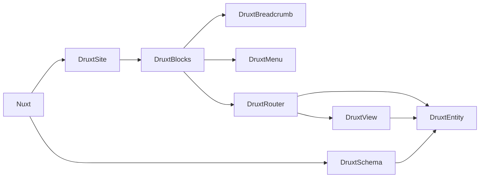

# Druxt 101

Fully Decoupled Drupal  
with JSON:API and Nuxt.js

<div class="pt-12">
  <span @click="$slidev.nav.next" class="px-2 p-1 rounded cursor-pointer" hover="bg-white bg-opacity-10">
    Press Space for next page <carbon:arrow-right class="inline"/>
  </span>
</div>

---
layout: image-right
image: https://s.gravatar.com/avatar/499831a65f45885a7e1b70ea47c06a58?s=800
---


# Stuart Clark

<div class="my-10 grid grid-cols-[40px,1fr] w-min gap-y-4">
  <mdi-briefcase class="opacity-50" />
  <div><a href="https://www.realityloop.com" target="_blank">Realityloop.com</a></div>
  <mdi-drupal class="opacity-50" />
  <div><a href="https://www.drupal.org/u/Deciphered" target="_blank">Deciphered</a></div>
  <mdi-github class="opacity-50" />
  <div><a href="https://github.com/decipher" target="_blank">Decipher</a></div>
  <mdi-earth class="opacity-50"/>
  <div>Australia</div>
</div>

<!--
Hello

I'm Stuart Clark:
* Senior Decoupled Developer @ Realityloop in Australia
* Drupal developer of 15 years
* Vue developer for 3/4 years
* Project lead of Druxt

With me today is ...
-->

---
layout: module
---

<div class="grid grid-cols-[2fr,2fr] gap-4">
  <div class="text-center pb-4">
    
    <div class="mb-2 text-sm">
      <h1>Druxt</h1>
      <a href="https://druxtjs.org" target="_blank">druxtjs.org</a><br />
      <a href="https://www.youtube.com/channel/UC3rybROe6cP9Uly_qQEW-4w" class="no-underline" target="_blank">
        <mdi-youtube class="inline-block no-underline opacity-50" />
      </a>
      <a href="https://twitter.com/druxtjs" class="no-underline" target="_blank">
        <mdi-twitter class="inline-block no-underline opacity-50" />
      </a>
    </div>
    <div class="opacity-50 mb-2 text-sm">
      An open source framework for building<br />
      Fully Decoupled Drupal integrations with Nuxt.js.
    </div>
    <div class="text-center">
      <a class="!border-none" href="https://www.npmjs.com/package/druxt" target="__blank"></a>
    </div>
  </div>
  <div class="!all:leading-12 !all:list-none my-auto">

  - Entities, Fields, Views, Blocks, Menus & more
  - JSON:API client + Vuex state management
  - Modular Vue.js component library
  - Drupal, Nuxt & Node modules
  - Fully Decoupled first
  - SPA / SSG / SSR

  </div>
</div>

<!--
What is Druxt?

Druxt is a framework for Frontend developers to build modern user experiences for Drupal.

Druxt consumes Content and Configuration from Drupal, allowing you the choice between "Doing it the Drupal way" and "Doing it the 'frontend' way", and anywhere in between; The freedom to "Do it your way".

Druxt exists because the frontend experience in Drupal has never been good. (Sorry, not sorry)
-->

---
layout: section
---

<div class="grid grid-cols-[2fr,2fr] gap-4">
  <div class="text-center pb-4">
    
    <div class="mb-2 text-sm">
      <h2>Drupal 8</h2>
      <a href="https://drupal.org/8" target="_blank">drupal.org/8</a>
    </div>
    <div class="opacity-50 mb-2 text-xl">
      Build something amazing
    </div>
    <div class="text-center">
    </div>
  </div>

  <div class="my-auto text-center pb-4 pl-8">
    
    <div class="mb-2 text-sm">
      <h2>Drupal 9</h2>
      <a href="https://drupal.org/9" target="_blank">drupal.org/9</a>
    </div>
    <div class="opacity-50 mb-2 text-xl">
      Build the best of the web
    </div>
    <div class="text-center">
    </div>
  </div>

  <div class="text-center pb-4">
    
    <div class="mb-2 text-sm">
      <h2>Vue.js</h2>
      <a href="https://vuejs.org" target="_blank">vuejs.org</a>
    </div>
    <div class="opacity-50 mb-2 text-xl">
      The Progressive JavaScript Framework
    </div>
    <div class="text-center">
      <a class="!border-none" href="https://www.npmjs.com/package/vue" target="__blank"></a>
    </div>
  </div>

  <div class="my-auto text-center pb-4 pl-8">
    
    <div class="mb-2 text-sm">
      <h2>Nuxt.js</h2>
      <a href="https://nuxtjs.org" target="_blank">nuxtjs.org</a>
    </div>
    <div class="opacity-50 mb-2 text-xl">
      The Intuitive Vue Framework
    </div>
    <div class="text-center">
      <a class="!border-none" href="https://www.npmjs.com/package/nuxt" target="__blank"></a>
    </div>
  </div>
</div>

<!--
Druxt is built on top of Drupal and Nuxt.

Drupal being a PHP framework for your backend, and Nuxt a Vue.js framework for your frontend.

Supports Drupal 8, 9, and can be used alongside existing decoupled distributions, such as ContentaCMS

Currently built for Vue 2 and Nuxt 2, expected to work with Nuxt 3 and Vue 3 ASAP.
-->

---
layout: module
---

<div class="grid grid-cols-[2fr,2fr] gap-4">
  <div class="text-center pb-4">
    
    <div class="mb-2 text-sm">
      <h1>Druxt<small class="text-sm text-gray-400">.module</small></h1>
      <a href="https://drupal.org/project/druxt" target="_blank">drupal.org/project/druxt</a>
    </div>
  </div>
  <div class="pl-8 my-auto">

  ### Requires:

  <div class="text-sm py-4 !all:leading-6 !all:list-none">

  - Decoupled Router
  - JSON:API Menu Items
  - JSON:API Views

  </div>

  ### Provides:

  <div class="text-sm py-4 !all:leading-6 !all:list-none">

  - Read-only permission for required resources
  - Block condition plugin bypass
  - Enables Cross-Origin Resource Sharing (CORS)

  </div>
  </div>
</div>

<!--
The Druxt module for Drupal handles all third party requirements, and provides a read-only permission to enable the Nuxxt modules to consume the required data.

The intent is to remove the requirement on this module in favour of a Drupal native solution.

Get in touch if you wish to help!
-->

---
layout: section
---

<div class="grid grid-cols-[2fr,2fr] gap-4">
  <div>
    <h2>DruxtBlocks</h2>
    <div class="pb-2 text-sm">Blocks and regions</div>
    <a class="!border-none" href="https://www.npmjs.com/package/druxt-blocks" target="__blank"></a>
  </div>

  <div>
    <h2>DruxtBreadcrumb</h2>
    <div class="pb-2 text-sm">Route based breadcrumbs</div>
    <a class="!border-none" href="https://www.npmjs.com/package/druxt-breadcrumb" target="__blank"></a>
  </div>

  <div>
    <h2>DruxtEntity</h2>
    <div class="pb-2 text-sm">Entities, forms and fields</div>
    <a class="!border-none" href="https://www.npmjs.com/package/druxt-entity" target="__blank"></a>
  </div>

  <div>
    <h2>DruxtMenu</h2>
    <div class="pb-2 text-sm">Menus and menu items</div>
    <a class="!border-none" href="https://www.npmjs.com/package/druxt-menu" target="__blank"></a>
  </div>

  <div>
    <h2>DruxtRouter</h2>
    <div class="pb-2 text-sm">Wildcard router</div>
    <a class="!border-none" href="https://www.npmjs.com/package/druxt-router" target="__blank"></a>
  </div>

  <div>
    <h2>DruxtSchema</h2>
    <div class="pb-2 text-sm">Entity display modes and field formatters</div>
    <a class="!border-none" href="https://www.npmjs.com/package/druxt-schema" target="__blank"></a>
  </div>

  <div>
    <h2>DruxtSite</h2>
    <div class="pb-2 text-sm">Out-of-the-box Decoupled Drupal</div>
    <a class="!border-none" href="https://www.npmjs.com/package/druxt-site" target="__blank"></a>
  </div>

  <div>
    <h2>DruxtViews</h2>
    <div class="pb-2 text-sm">Drupal Views pages and blocks</div>
    <a class="!border-none" href="https://www.npmjs.com/package/druxt-views" target="__blank"></a>
  </div>
</div>

<!--
Druxt provides 8 modules,
each can be used on it's own to target specific Decoupled Drupal functionality, providing Node modules, Vue components, Vuex stores and more.

Some parts of these modules can be used with other javascript libraryes (React), such as the DruxtSchema module.

Custom modules can be added by extending the DruxtModule vue component.
-->

---
class: text-center
layout: fact
---

# TL;DR

## Druxt = DRUpal + nUXT

<!--
To put it simply, Druxt is Drupal plus Nuxt.
-->

---
layout: section
---

# Table of Contents

0. Introduction
1. Demo - Umami Parity project
2. Getting started using DruxtSite
3. Theming (DruxtWrapper)
4. Blocks & Regions
5. Storybook
6. Reactivity and v-model
7. Static Site Generation
8. Q & A

<!--
Druxt is a big project, and there is a lot to talk about.

In case we are unable to cover everything today, checkout the slides in your own time.
-->

---
background: /images/modules-druxt-site.png
class: text-center
layout: cover
---

# Demo

## Umami Parity project

https://demo.druxtjs.org

<!--
Let's get started with a Demo of the Umami Parity project
-->

---
class: text-sm
id: R6eM3JQ_pv8
layout: youtube-right
---


# Umami Parity project

<div class="mb-10" />

<div class="my-10 grid grid-cols-[40px,260px] w-min gap-y-4">
  <ri-cloud-line class="opacity-50"/>
  <div><a href="https://demo.druxtjs.org" target="_blank">demo.druxtjs.org</a></div>
  <ri-cloud-line class="opacity-50"/>
  <div><a href="https://druxt-umami.netlify.app" target="_blank">druxt-umami.netlify.app</a></div>
  <ri-artboard-line class="opacity-50"/>
  <div><a href="http://umami-storybook.druxtjs.org" target="_blank">umami-storybook.druxtjs.org</a></div>
  <ri-github-line class="opacity-50"/>
  <div><a href="https://github.com/druxt/demo.druxtjs.org" target="_blank">github.com/druxt/demo.druxtjs.org</a></div>
  <ri-github-line class="opacity-50"/>
  <div><a href="https://github.com/druxt/demo-api.druxtjs.org" target="_blank">github.com/druxt/demo-api.druxtjs.org</a></div>
</div>

<!--
The Umami installation profiles provides a great example of what Drupal can give you out of the box.

As such, it's the obvious choise to demonstrate what the DruxtSite can give you out of the box.

Let's take a quick look:
[Demo]

Features:
- Search layout component
- Drupal driven entities / contact form
- Frontend editing
- Storybook integration
-->

---
class: text-center
layout: cover
---

# Getting Started

## using DruxtSite

<!--
DruxtSite is the quickest way to get started if you are looking to build a decoupled Site.

It's nearly zero-config and sets up all the required frontend modules for a semi-traditional Drupal site with a Vue.js based theme layer.
-->

---
layout: youtube-left
id: PQcTyIpdHsk
---


# Getting Started

## Drupal

1. Download Drupal
```sh
composer create-project -s dev drupal/recommended-project [DESTINATION]
```

2. Download Druxt module
```sh
composer require drupal/druxt
```

3. Quickstart
```sh
php ./web/core/scripts/drupal quick-start
```

4. Install Druxt module: [/admin/modules](http://127.0.0.1:8888/admin/modules#edit-modules-other)

5. Configure permissions: [/admin/people/permissions](http://127.0.0.1:8888/admin/people/permissions#module-druxt)

<!--
The only thing needed to enable Druxt on Drupal is the Druxt module, and to add it's provided permission to a role of your choice.

It only takes about 1:30 to go from zero-code to Druxt ready Drupal.

## Timing

- 0:35 - Drupal downloaded
- 0:47 - Druxt module downloaded
- 1:07 - Drupal installed
- 1:37 - Druxt Setup
-->

---
layout: youtube-right
id: aWoQRb4F3FY
---


# Getting Started

## Nuxt

1. Download Nuxt
```sh
npx create-nuxt-app [DESTINATION]
```

2. Download DruxtSite module
```sh
npm i druxt-site
```

3. Configure `nuxt.config.js`
```js
buildModules: ['druxt-site'],
druxt: {
  baseUrl: 'https://example.com',
  // (optional) Disable Nuxt `pages/`
  router: { pages: false },
}
```

4. `npm run dev`

<!--
Druxt uses the Nuxt framework for it's "frontend".

Nuxt is a modular Vue.js framework, much like Drupal is a module PHP framework.

Nuxt does all the hard things you don't want to have to do when decoupling or working with javascript:
- Builds your javascript bundle
- Provides extensible page based routing
- Supports Server Side and Client side rendering as well as Static Site Generation

Installation is easy, with a CLI wizard: `npx crate-nuxt-app`
Configuration is done in the `nuxt.config.js` file.

## Timing

- 1:00 - Nuxt downloaded
- 1:19 - DruxtSite downloaded
- 1:51 - Setup
-->

---
layout: youtube-left
id: null
---


# Quickstart

## with Gitpod

<div class="mb-5" />

> One click, Fully Decoupled Drupal Site starter-kit with Druxt.

<div class="mb-20" />

https://github.com/druxt/quickstart-druxt-site

<div class="mb-10" />

[](https://gitpod.io/#https://github.com/druxt/quickstart-druxt-site)

<!--
@TODO - Make video

To make things even easier, you can use the DruxtSite Quickstart repository on Gitpod to be full decoupled in a cloud IDE:

- Click the button
- Login with Github
- Wait just a little bit
-->

---
class: text-center
layout: cover
---

# Welcome to DruxtSite

## (Live demo)

<!--
Druxt extends Nuxt, and in the case of the DruxtSite module we can see that by the presence of the DruxtRouter wildcard route.

Nuxt has a Page based routing system, which allows frontend driven campaign pages and single page apps, among other things, but in our case we want Drupal to serve the homepage, so I'll go ahead and delete this page.

1. Show Page
2. Open VueDevTools > Routes
3. Delete `pages/index.vue`
4. Reveal no content.
5. Add content
6. Show content.
7. Recap
-->

---
layout: section
---

# How the Druxt does it work?



---
background: /images/drupal-cms.png
class: text-center
layout: cover
---

# Content & Configuration

## in the back

<!--
1. Open Drupal backend: http://127.0.0.1:8888
2. Add content: Decopled Days 2021 * 2
3. Show Frontend.
4. Walkthrough Entity Components data
5. Recap
-->

---
background: /images/components.png
class: text-center
layout: cover
---

# Theming

## DruxtWrapper

---
layout: full
---

# Theming

### Wrappers & slots

```vue {all|1-7|9-15|17-21}
<template>
  <BCard>
    <h2>{{ entity.attributes.title }}</h2>
    <slot name="body" />
    <BButton :to="link" variant="success">Read more</BButton>
  </BCard>
</template>

<script>
export default {
  computed: {
    link: ({ entity }) => entity.attributes.path.alias || `/node/${entity.attributes.drupal_internal__nid}`,
  },
}
</script>

<style scoped>
h2 {
  color: #007bff;
}
</style>
```

<!--
Druxt provides Wrapper components for theming the modules.

A wrapper is just a Vue component:
- Template: `.tpl.php/.twig` HTML + Components, Slots and Mustache templates.
- Script: `.js` Vue & Nuxt data, props, methods, etc
- Style: `.css` Multi-lingual, scope, PostCSS processing
-->

---
layout: full
---

# Theming

### $attrs, props & mixins

<div class="grid grid-cols-[2fr,2fr] gap-4 mt-4 text-sm">
  <div>

```jsx
<template>
  <div>{{ $attrs.entity.attributes.title }}</div>
</template>
```

All unregistered props data is provided as `$attrs`.

It is recommended to register your `props`, or use the `mixin` provided by the module.

  </div>
  <div>

```jsx
<template>
  <div>{{ entity.attributes.title }}</div>
</template>

<script>
import { DruxtEntityMixin } from 'druxt-entity'

export default {
  mixins: [DruxtEntityMixin],
}
</script>
```

  </div>
</div>

<!--
Each module provides slots and $attrs as well as a mixin to register props.
-->

---
image: /images/components.png
layout: image-right
position: left
---

# Theming

### Wrapper component options + discovery


<!--
- Druxt modules provide options for the Wrapper component.  
- Nuxt (>= v2.13) auto imports components.  
- First available option is used.  
- Most modules provide a default if no Wrapper component found.  
-->

---
background: https://source.unsplash.com/collection/94734566/1920x1080
class: text-center
layout: cover
---

# Prettification

## (Round 2)

<!--
1. Inspect DruxtEntity with VueDevTools
2. Show data > component > options.
3. Create `druxt/entity/node/article/Teaser.vue`
4. Navigate to node
5. Explain missing fields and DruxtWrapper
6. Create `druxt/entity/node/article/Default.vue`
7. Add `<DruxtView view-id="frontpage" />`
8. Goto Blocks demo
-->

---
background: /images/druxt-block-region.png
class: text-center
layout: cover
---

# Blocks & Regions

## (Round 3)

<!--
1. Create new `layouts/default.vue`
2. Add `<DruxtSite theme="bartik" />`
3. Add customised version of layout
4. Explain DruxtWrapper / Block decoupling
5. Add `components/druxt/block/SystemBrandingBlock.vue`
6. [BACKEND] Show blocks, remove title, tabs, help, actions, etc
7. Recap
-->


---
background: /images/druxt-block-region.png
layout: module
---

<div class="grid grid-cols-[2fr,2fr] gap-4">
  <div class="pb-4 text-center">
    
    <div class="mb-2 text-sm">
      <h1>DruxtBlocks</h1>
      <a href="https://blocks.druxtjs.org" target="_blank">blocks.druxtjs.org</a>
    </div>
    <div class="opacity-50 mb-2 text-sm">
      Provides Drupal blocks and region components.
    </div>
    <div class="text-center">
      <a class="!border-none" href="https://www.npmjs.com/package/druxt-blocks" target="__blank"></a>
    </div>
  </div>
  <div class="pb-4 pl-8">

```vue
// DruxtBlock component
<template>
  <DruxtBlock :id="drupal_internal__id" />
</template>
```

```vue
// DruxtBlockRegion component
<template>
  <DruxtBlockRegion :name="name" :theme="theme" />
</template>
```

  </div>
</div>

---
background: /images/umami-storybook.png
class: text-center
layout: cover
---

# Storybook

---
id: ek8BlCghwkE
layout: youtube-right
---


# @nuxtjs/storybook

[storybook.nuxtjs.org](https://storybook.nuxtjs.org/)

<div class="mb-8" />

### + Druxt =

Zero-config, auto-generated Storybook integration with Druxt modules.

<div class="mb-16" />

## Getting started

<div class="mb-4" />

1. Download @nuxtjs/storybook module
```sh
npm i -D @nuxtjs/storybook
```

2. `npx nuxt storybook`

<!--
[MAKE SURE TO START STORYBOOK AFTER CONTENT WAS CREATED]

Druxt provides zero-config, auto-generated Storybook integration.

## Timing

- 0:31 - Installed
- 1:05 - Running

### Blocks

1. Bartik > Secondary Menu >> DruxtBlock (initial)
2. Docs tab
3. Expand "Content" region

### Entity

- 1:30

1. Node > Article > View displays > Default
2. Canvas tab
3. Mode > teaser
4. Change UUID (needs 2xArticles)

### Views

- 1:50

1. Frontpage > Master
2. Open in new tab
3. Vue developer tools
-->

---
background: /images/umami-storybook.png
class: text-center
layout: cover
---

# Story time

## (Round 4)

<!--
1. Open Storybook > Entity > Node > Article > View displays > Docs
2. Brief walkthrough
3. Open Default in new tab
4. Open Vue dev tools
5. Add template
    ```vue
    <template>
    </template>
    ```
-->

---
background: https://source.unsplash.com/collection/94734566/1920x1080
class: text-center
layout: cover
---

# Reactivity & v-model

---
class: text-sm
id: OL_bRANN6oA
layout: youtube-right
---

# v-model

<div class="my-10 grid grid-cols-[40px,260px] w-min gap-y-4">
  <ri-cloud-line class="opacity-50"/>
  <div><a href="https://nginx.feature-239-editbar.demo-druxtjs-org.au2.amazee.io/en/recipes/vegan-chocolate-and-nut-brownies" target="_blank">nginx.feature-239-editbar.demo-druxtjs-org.au2.amazee.io</a></div>
  <mdi-github class="opacity-50" />
  <div><a href="https://github.com/druxt/demo.druxtjs.org/pull/261" target="_blank">druxt/demo.druxtjs.org/pull/261</a></div>
</div>

```vue
<template>
  <div>
    <DruxtEntity v-bind="props" v-model="model">
    <DruxtEntityForm v-bind="props" v-model="model">
  </div>
</template>

<script>
export default {
  data: () => ({
    model: null,
    props: { type: 'node--article', uuid: '...' }
  }),
}
</script>
```

<!--
[Click play]

The EditBar is a User Experience experiment to demonstrate one of the many ways to bring editing to the frontend in a Fully Decoupled Drupal site.

Let's take a quick walk through of the site __ BRIAN:
(BRIAN TO SHARE)
- This is the first time I've seen a content preview out of Drupal that actually works

The source code is all available on github, so be sure to check it out.
-->

---
background: https://source.unsplash.com/collection/94734566/1920x1080
class: text-center
layout: cover
---

# It's time to react

## (Round 5)

---
id: SoWU5PfE7SI
layout: youtube-right
---

# Static Site Generation

1. Configure `nuxt.config.js`
```js
target: 'static',
ssr: true,

// optional.
generate: {
  routes: ['/', '/en', '/es'],
}
```

2. `npm run generate`

3. (optional) `npm start`

<!--
Static Site generation works out of the box, as long as you have `target: 'static'` set.

Nuxt will crawl all accessible links and generate HTML pages for Drupals content.

If
-->

---
class: text-center
layout: cover
---

# Sponsors

<div class="grid grid-cols-[2fr,2fr] gap-4">
  <div class="text-center pb-4 mt-8">
    <a href="https://www.realityloop.com" target="_blank"></a>
    <div class="mb-2 text-sm mt-14">
      <h2>Development</h2>
    </div>
  </div>

  <div class="my-auto text-center pb-4 pl-8">
    <a href="https://amazee.io" target="_blank"></a>
    <div class="mb-2 text-sm">
      <h2>Hosting</h2>
    </div>
  </div>
</div>

<!--
A big thanks to Realityloop for sponsored development on the project.

And to lagoon for providing community hosting for the website.
-->

---
class: text-center
layout: cover
---

# Q & A

### [Your question goes here]

<div class="mb-10" />

# Find out more

<div class="grid grid-cols-[2fr,2fr] gap-4 !all:border-0 mt-5 !all:mb-5">
  <a href="https://druxtjs.org">druxtjs.org</a>
  <a href="https://github.org/druxt">github.org/druxt</a>
  <a href="https://discord.druxtjs.org">discord.druxtjs.org</a>
  <a href="https://druxt-101.slides.realityloop.com">druxt-101.slides.realityloop.com</a>
</div>
