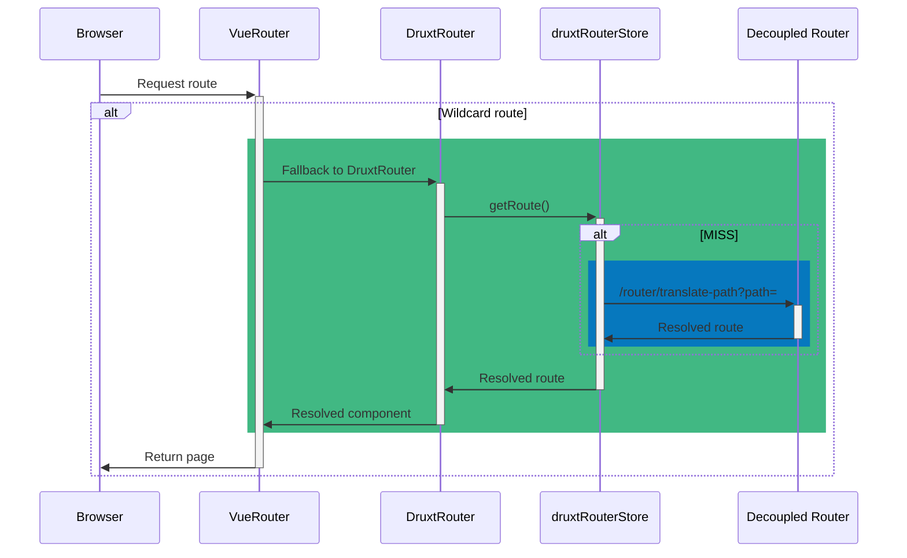

<!--
This is provided via the DruxtRouter module, which uses Drupals Deocupled Router module to determine the JSON:API resource and Druxt component to render.

The route data is cached in the druxtRouter vuex store, reducing queries to the Drupal backend.
-->
